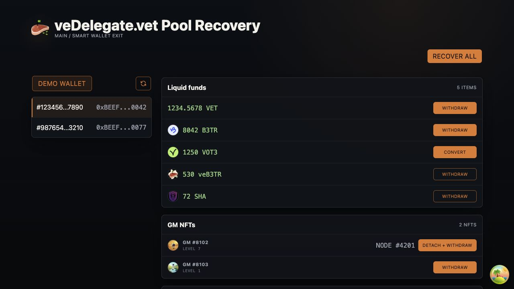
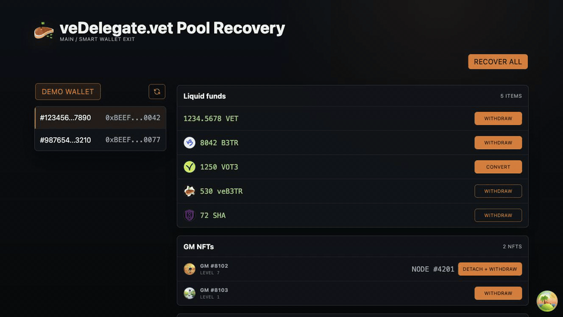
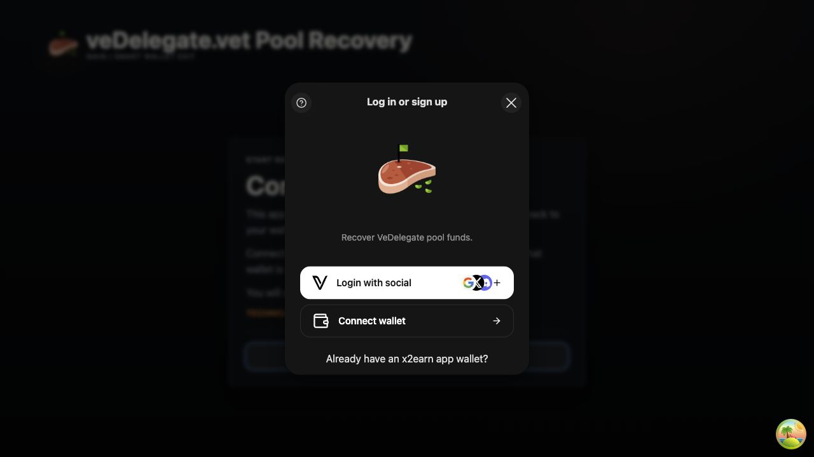
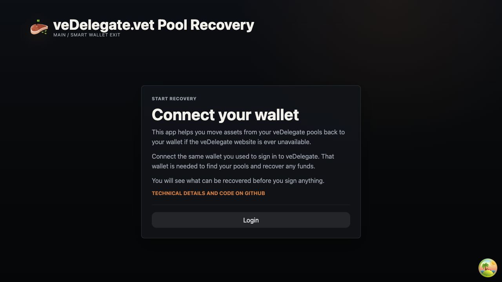

# veDelegate.vet Pool Recovery

A static browser app for recovering assets from veDelegate pool smart wallets.

Use it when you need to recover assets from pools owned by your veDelegate sign-in wallet. The app connects with VeChain Kit, finds owned pools, scans recoverable assets, previews each transaction, then sends recovery calls through the selected pool smart wallet.

Live app:

https://vechain-energy.github.io/vedelegate-recovery/



## Recovery Demo



[Open recovery demo GIF](docs/videos/recovery-demo.gif)

## Features

- Connect with VeChain Kit on VeChain mainnet.
- Find veDelegate pool NFTs owned by the connected wallet.
- Show all pool smart wallets and switch between them.
- Scan liquid VET, registry ERC20 tokens, core tokens, GM NFTs, and locked terms.
- Preview what the signer wallet receives before signing.
- Show transaction pending, confirmed, and reverted states.
- Refresh pool balances after successful recovery.
- Run without a backend. The app is static and GitHub Pages ready.

## Recoverable Assets

- VET held by a pool wallet.
- ERC20 balances from the official VeChain token registry.
- Core B3TR, VOT3, and veB3TR balances.
- VOT3 conversion back to B3TR.
- GM NFTs held by the pool.
- Ended Lock-2-Earn terms owned by the pool.

GM NFTs with an attached node are detached first, then transferred. If no node is attached, only the NFT transfer is built.

Ended auto-renew terms are handled in order: disable auto-renew, close term, withdraw term funds into the pool. After that, run normal B3TR recovery or recover all.

## Wallet Connection

Connect with the same wallet used to sign in to veDelegate. That wallet proves pool ownership and is required to recover funds if the veDelegate website is ever unavailable.

The app uses VeChain Kit's reusable wallet button. Social login stays enabled. VeWorld, Sync2, WalletConnect, and VeChain ecosystem login are supported by provider config. Wallet text is shown in English.





## Recovery Flow

1. Connect the same wallet used to sign in to veDelegate.
2. Press the refresh icon to scan pools.
3. Select a pool.
4. Review liquid funds, GM NFTs, and locked terms.
5. Press a single asset action or `Recover all`.
6. Read the simulation modal before signing.
7. Sign in the connected wallet.
8. Wait for pending, confirmed, or reverted state.
9. Close the modal. The app scans again after confirmed transactions.

## Transaction Preview And Status

Before signing, the app simulates the transaction against the configured Thor node with the connected wallet as caller.

The modal lists only assets that move to the signer wallet:

- Native VET transfers.
- ERC20 `Transfer` events.
- GM NFT `Transfer` events.

If simulation reverts, signing is blocked and the revert text is shown.

After signing, the modal shows pending state, transaction ID, VeChainStats link, then confirmed or reverted state.

## Recovery Rules

All recovery calls execute through the selected pool smart wallet. The signer stays the owner wallet.

Recover-all is a multi-clause transaction. Clauses run in safe order:

1. Transfer VET.
2. Convert VOT3 to B3TR.
3. Transfer ERC20 tokens.
4. Detach linked GM NFTs when needed.
5. Transfer GM NFTs.

If one clause fails, the whole transaction fails.

## Token Sources

Registry tokens come from:

```text
https://vechain.github.io/token-registry/main.json
```

The app always includes the core token set:

- B3TR
- VOT3
- veB3TR

VET is native and has no token image.

## Local Development

```sh
npm install
npm run dev
```

Open:

```text
http://127.0.0.1:5173/
```

Demo data is disabled by default. Enable it only for local screenshots and QA:

```sh
VITE_ENABLE_DEMO_DATA=true npm run dev
```

Demo routes:

```text
/?demo=balances
/?demo=scanning
```

Run checks:

```sh
npm run test
npm run build
```

## Configuration

Defaults target VeChain mainnet.

Copy `.env.example` to `.env` when overrides are needed:

```sh
VITE_NETWORK=main
VITE_NODE_URL=https://mainnet.vechain.org
VITE_VEDELEGATE_ADDRESS=
VITE_B3TR_ADDRESS=
VITE_VOT3_ADDRESS=
VITE_VEB3TR_ADDRESS=
VITE_LOCKED_TERMS_ADDRESS=
VITE_GALAXY_MEMBER_ADDRESS=
VITE_WALLET_CONNECT_PROJECT_ID=
VITE_DELEGATION_URL=
VITE_BASE_PATH=
VITE_ENABLE_DEMO_DATA=false
```

`NEXT_PUBLIC_NETWORK_TYPE` is defined for VeChain Kit compatibility and defaults to `main`.

## GitHub Pages

Pages deploys from GitHub Actions.

Workflow:

```text
.github/workflows/pages.yml
```

The workflow runs:

1. `npm ci`
2. `npm run test`
3. `npm run build`
4. upload `dist`
5. deploy to GitHub Pages

Vite base path uses `VITE_BASE_PATH` first, then the repository name from `GITHUB_REPOSITORY`.

`.nojekyll` is copied from `public/.nojekyll` into the built site.

## Design Notes

The UI is an operator tool, not a marketing page. It keeps pool data, balances, hashes, status, and recovery actions visible with minimal decoration. Orange is reserved for actions. VeChain Kit styles stay isolated under `#vechain-kit-root`.

## License

Unlicensed. All rights reserved.
